# Инструкция по работе с **Git**
Git - программа для контроля версий

Программа Git берёт на себя контроль версий.
проекта и позволяет переключаться между
ними. Обратите внимание: Git хранит не файлы целиком, а отличия между ними.

**Основные команды Git:**

Осваивать Git проще процессе редактирования текстовых файлов. Markdown – язык разметки,
который позволяет форматировать текст. Для написания в редакторе VS Code используется
синтаксис языка.

Все команды задаём при помощи написания кода в терминале.
Прежде чем создавать репозиторий и инициализировать Git, проверим текущую установленную
версию пограммы. Для этого в терминале введём команду:

>git --version

>

*Если Git установлен на компьютер, вы увидите его текущую версию.
Программа использует мнемонические команды, которые легко запомнить, если знать
английский язык.*

>git init – инициализация локального репозитория
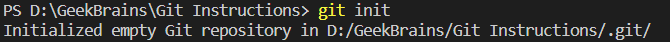

>git status – получить информацию от git о его текущем состоянии
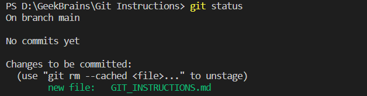

>git add – добавить файл или файлы к следующему коммиту
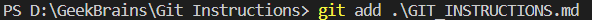

>git commit -m “message” – создание коммита.
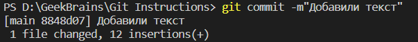

>git log – вывод на экран истории всех коммитов с их хеш-кодами
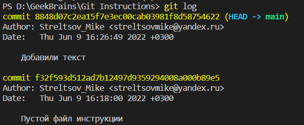

>git checkout – переход от одного коммита к другому
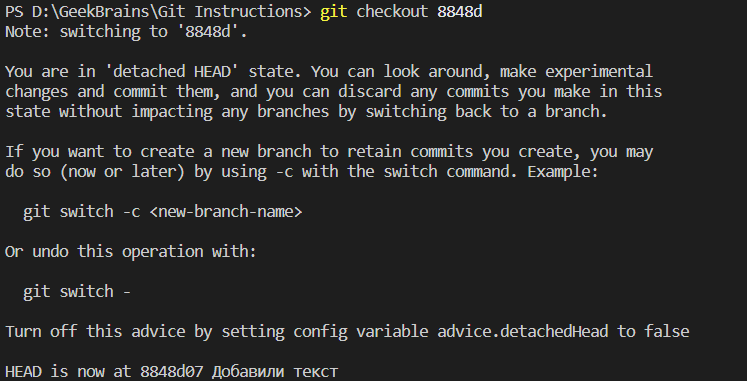

>git checkout master – вернуться к актуальному состоянию и продолжить работу
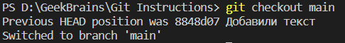

>git diff – увидеть разницу между текущим файлом и закоммиченным файлом
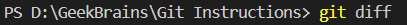

>git branch <название ветки> – создать новую ветку  
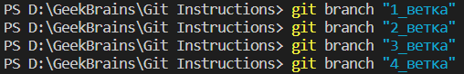

>git branch – посмотреть список веток в репозитории
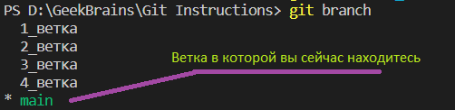

>git branch -d <название ветки> – удалить ветку
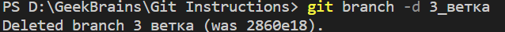

>git log --graph  – журнал коммитов с визуализацией
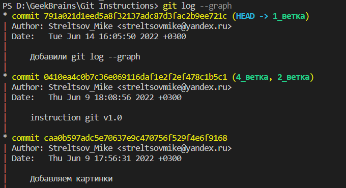

>git commit -a -m “текст_коммита”  –  создание изменения и его коммит
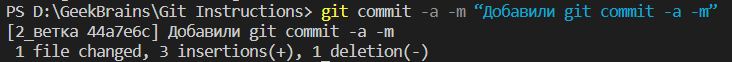
